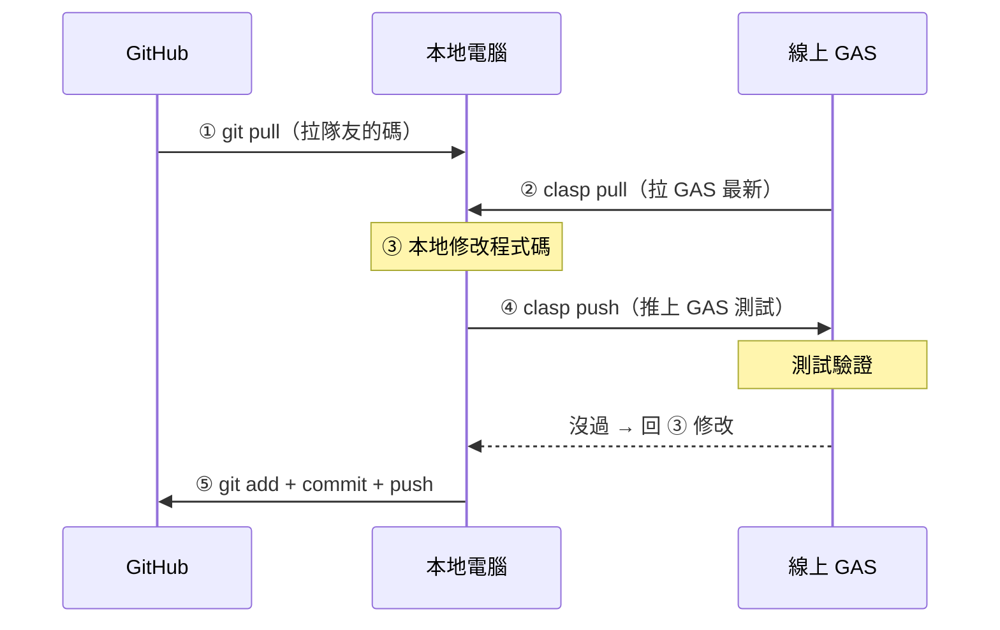

# f2e-gas-admin

B Team（F2E）行政自動化用的 **Google Apps Script（GAS）monorepo**。
把散落在 script.google.com 的各個 GAS 專案，用 [clasp](https://github.com/google/clasp) 接進本地、統一版控。

每個 GAS 專案（一個 Script ID）在 repo 底下各佔一個子資料夾，各自有獨立的 `.clasp.json`。

---

## 目前使用環境

| 項目 | 版本 |
|---|---|
| macOS | 26.5 (arm64) |
| Node.js | v22.1.0（nvm） |
| npm | 10.7.0 |
| clasp | 3.3.0（mise） |

---

## 專案結構

```
f2e-gas-admin/
├── README.md
├── .gitignore
├── slackBotProxy/          # Slack bot event proxy（@Alice 入口）
│   ├── .clasp.json
│   └── src/
│       ├── appsscript.json
│       └── slackBotProxy.js
└── <其他 GAS 專案>/         # 結構相同
    ├── .clasp.json
    └── src/
```

- 資料夾命名一律 **駝峰式 camelCase**（`slackBotProxy`、`leaveManagement`、`notifyLib`…）。
- `.clasp.json`：存該專案的 Script ID 與 `rootDir`，**可進版控**。
- `.clasprc.json`：OAuth 憑證，**絕不進版控**（見 `.gitignore`）。

---

## 已接入的專案

| 資料夾 | 用途 | 備註 |
|---|---|---|
| `slackBotProxy` | Slack Event Subscription 接收與 app_mention 路由 | GAS Web App，對外 `/exec` |
| `googleDriveHtmlPreviewer` | 將雲端硬碟 RA 資料夾底下的 HTML 檔直接渲染成網頁；並提供補問清單的「送出答案」 | GAS Web App，`?p=` 帶相對路徑；以存取者身分執行，實際可見範圍由 Drive 權限決定 |
| _（待補）_ | | |

### 部署後要設的 Script Properties

| 專案 | 屬性 | 用途 |
|---|---|---|
| `slackBotProxy` | `SLACK_TOKEN` / `GITHUB_TOKEN` / `NOTIFY_KEY` / `CHAT_PROVIDER` | 見 `core/diagnose.js` |
| `googleDriveHtmlPreviewer` | `GITHUB_TOKEN` | 對 augma 發 `repository_dispatch`（補問清單的「送出答案」） |

> **補問清單的「送出答案」怎麼走**
> `checkList.html` 是 previewer 用 `HtmlService` 算繪的，所以頁面跑在 previewer 的
> sandbox 裡，能直接 `google.script.run.submitChecklistAnswers(...)`——不必處理 CORS，
> 更重要的是**不必把任何金鑰放進那份 HTML**（它躺在 Drive 上、分享給整個根資料夾的名單）。
> previewer 收到後自己對 GitHub 發 `repository_dispatch(resume)`，不經過 `slackBotProxy`。
>
> **為什麼不經 `slackBotProxy` 共用它的去重鎖**：`digest` 模式下這一頁是**唯一**的
> 作答入口——Slack 那則訊息沒有按鈕（走 `notify-ra-result.sh`），而貼回 thread 的
> 補問回覆已由 `core/classifiers/rules.js` 的規則 1 依每題的 `notify_mode` 擋在
> 分類器（那份資料根本不會流進作答機制，`core/answer.js` 一行都沒動）。
> 沒有第二個寫入者，就不需要跨專案共用鎖，也就不必為此改動 Slack 機器人主幹。
>
> ⚠️ **這個結論綁死在「`card` 模式不使用」這個前提上。** 哪天 `AUGMA_DECISION_MODE`
> 真的被切成 `card`，Slack 卡片會長出按鈕，而那些按鈕的題號**與這一頁完全相同**
> （augma 的 `ra-phase4` 規定卡片題號原樣沿用 `checkList` 的題號）。屆時兩個入口
> 各有一顆快取、互相看不見，就會回到 `core/answer.js` 開頭記的那個競態。
> 真要啟用 `card`，正解是把 previewer 改成轉一手給 `slackBotProxy`、共用同一把鎖。
>
> **多視窗**：同一份清單開在兩個視窗、兩邊都按送出——前端的按鈕 `disabled` 只鎖得住
> 同一個頁面實例，跨視窗完全無效。擋下它的是 previewer 的
> `LockService.getScriptLock()`＋去重快取：鎖負責「同一瞬間只有一個進得去」，
> 快取負責「進去之後發現這些題已經收過了」。少了鎖，兩個請求會雙雙讀到空快取而
> 雙雙 dispatch，第二次會把正在跑的 agent 砍掉（phase job 是 `cancel-in-progress`）。
>
> ⚠️ `submitChecklistAnswers` 引入 `UrlFetchApp`，previewer 因此多要一個
> `script.external_request` 權限。部署是 `executeAs: USER_ACCESSING`，所以
> **既有使用者下次開啟頁面時會被要求重新授權一次**——這是預期內的一次性摩擦。

---

## 環境需求

| 工具 | 用途 | 說明 |
|---|---|---|
| **Node 18+** | clasp 的執行 runtime | 由 nvm 管理 |
| **mise** | 全域安裝 clasp | 只管 clasp，不管 Node |
| **clasp v3.x** | GAS 版控 CLI | 透過 mise 安裝，可直接打 `clasp` |

> Node 由 nvm 管、clasp 由 mise 管，兩者分工。mise 不接管 Node，避免與既有設定衝突。

---

## 初次設定（每台機器一次）

### 1. 安裝 Node（18 以上）

clasp 需要 Node 18 以上。用 nvm 安裝並切換：

```bash
nvm install 22
nvm use 22
node -v            # v22.x
```

### 2. 用 mise 全域安裝 clasp

```bash
mise use -g npm:@google/clasp@3.3.0
```

確認 mise 的 activate 已在 shell 生效（`~/.zshrc` 內含 `eval "$(mise activate zsh)"`），重開終端後：

```bash
clasp --version    # 應印出 3.3.0
```

### 3. 開啟 Apps Script API

前往 <https://script.google.com/home/usersettings>，把「Google Apps Script API」開成 **On**。

### 4. 登入 Google

```bash
clasp login
```

用有權限存取這些 GAS 的 Google 帳號登入。若出現「Google hasn't verified this app」警告，這是自寫腳本的正常提示：Advanced → Go to ... (unsafe) → Allow。憑證存於 `~/.clasprc.json`，一個帳號登一次即可。

---

## 接入一個既有的 GAS 專案

在 **repo 根目錄**執行。用 `--rootDir` 把程式碼導進子資料夾，再把 `.clasp.json` 搬進去（`.clasp.json` 固定生在執行指令的當前目錄，`--rootDir` 只管程式碼落點）。

```bash
cd f2e-gas-admin

# 取得 Script ID：GAS 專案 → 專案設定（齒輪）→ 指令碼 ID
clasp clone <SCRIPT_ID> --rootDir ./<資料夾名稱>
mv .clasp.json <資料夾名稱>/
```

範例（slackBotProxy）：

```bash
clasp clone 1aWiCCio...SmYiDZvsbwcFAkMUb --rootDir ./slackBotProxy
mv .clasp.json slackBotProxy/
```

確認結構：

```bash
ls -la slackBotProxy      # 要看到 .clasp.json 與 src/
```

> **第一次接既有專案一律用 `clone` / `pull`，不要 `push`** —— push 會用本地空目錄覆蓋線上程式碼。

---

## 日常工作流程

> 詳細圖文說明請參考 [clasp 日常開發指南](docs/clasp-dev-guide.html)。

### 先搞懂：程式碼在三個地方

| 地方 | 角色 | 工具 |
|---|---|---|
| **GitHub** | 歷史備份、團隊協作 | `git pull` / `git push` |
| **本地電腦** | 你實際寫程式的地方（中間點） | — |
| **線上 GAS** | 程式實際執行的地方 | `clasp pull` / `clasp push` |

clasp 和 GitHub **沒有直接關係**。只有你的本地電腦同時連著兩邊，所有東西都經過本地中轉。

> **pull = 拉下來、push = 推上去**，方向都是相對「本地」而言。
> **clasp 的 pull / push 是「覆蓋」，不是「合併」。** 誰後到誰贏、沒有智慧合併，所以更要守紀律。

### 完整開發循環（以 slackBotProxy 為例）



#### ① ② 開工前：兩個 pull

```bash
git pull
clasp pull --project slackBotProxy
```

- `git pull`：問 GitHub「有沒有隊友推的新東西？」
- `clasp pull`：問線上 GAS「有沒有人直接在編輯器改過？」

> ⚠️ `clasp pull` 會覆蓋本地檔案。本地有未 commit 的改動時，先 `git stash` 或 `git commit` 再 pull。

#### ③ 本地修改

用編輯器改 `slackBotProxy/` 底下的檔案。養成習慣一律在本地改，本地是「真相來源」。

#### ④ 推上 GAS

```bash
clasp push --project slackBotProxy
```

推完用 `clasp open --project slackBotProxy` 開線上編輯器確認。密集開發時可用 `clasp push --watch` 存檔自動推。

#### ⑤ 存進 GitHub

```bash
git add slackBotProxy/
git commit -m "feat(slackBotProxy): 加入 XXX 功能"
git push
```

> `clasp push` → 推到 GAS，讓程式能跑。`git push` → 推到 GitHub，留歷史紀錄。兩件事都要做。

### Web App 部署（有 doPost 才需要）

`clasp push` 只更新程式碼，**不會更新對外的 `/exec` 網址**。改了 `doPost` 邏輯後，還要「更新部署」外部呼叫才會跑到新碼：

**推薦做法：** GAS 編輯器 → 右上「部署」→「管理部署作業」→ 編輯 → 版本選「新版本」→ 部署。網址不變、內容更新。

| 改了什麼 | 要做什麼 |
|---|---|
| doPost / doGet 邏輯 | clasp push **＋ 更新部署** |
| 只改手動跑的 function | clasp push 就夠 |
| 只改註解、重構 | clasp push 即可 |

---

## 常見問題

| 症狀 | 原因 | 處理 |
|---|---|---|
| `node:fs/promises` 沒有 `constants` export | Node 版本 < 18 | `nvm use 22` |
| 直接打 `clasp` 找不到指令 | mise activate 未生效 | 確認 `~/.zshrc` 有 `eval "$(mise activate zsh)"`，重開終端 |
| `Project file already exists` | 當前/上層目錄有殘留 `.clasp.json` | 清掉殘留：`rm -f .clasp.json && rm -rf src` 再重試 |
| `.clasp.json` 跑到 repo 根目錄 | 它固定生在執行指令的目錄 | 用 `mv .clasp.json <資料夾名稱>/` 搬進子資料夾 |
| pull 報未授權 / 401 | 憑證失效 | `clasp login` 重新登入 |
| pull 拉不到檔案 | Script ID 錯 / 未開 API | 核對 Script ID；確認已開 Apps Script API |

---

## 慣例

- 資料夾命名：駝峰式 camelCase。
- 一個 GAS 專案（Script ID）= 一個子資料夾 = 一個 `.clasp.json`。
- 共用 Library（如 `notifyLib`、`envLib`）各自是獨立 Script ID，各自接一個子資料夾。
- `.clasprc.json` 含 OAuth 憑證，永遠不進版控。