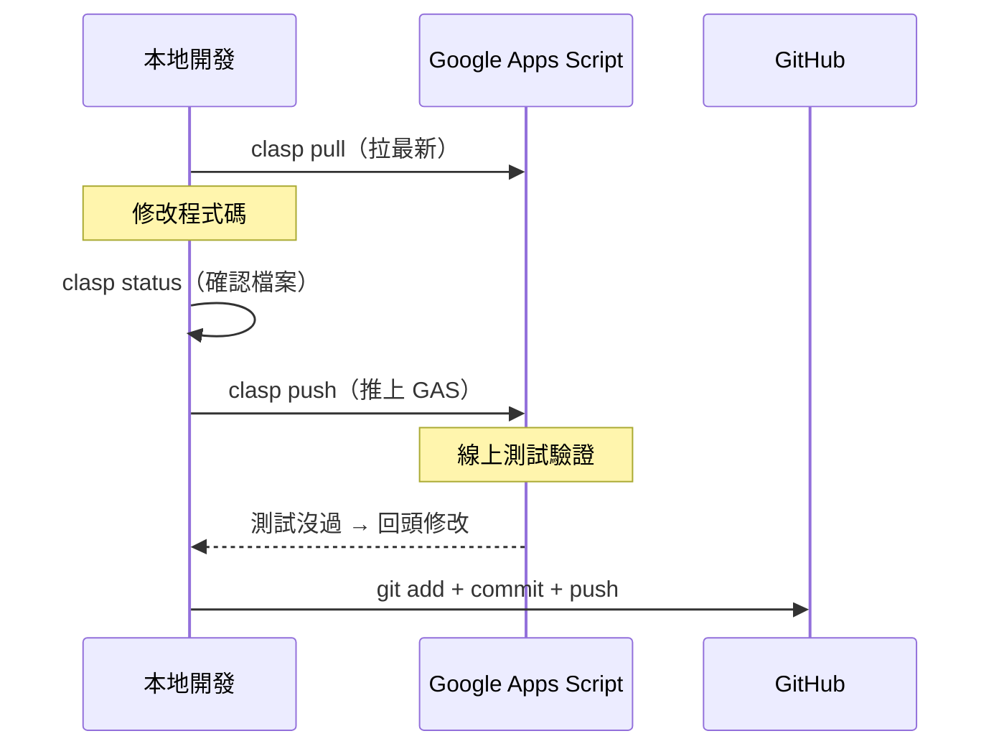

# f2e-gas-admin

B Team（F2E）行政自動化用的 **Google Apps Script（GAS）monorepo**。
把散落在 script.google.com 的各個 GAS 專案，用 [clasp](https://github.com/google/clasp) 接進本地、統一版控。

每個 GAS 專案（一個 Script ID）在 repo 底下各佔一個子資料夾，各自有獨立的 `.clasp.json`。

---

## 目前使用環境

| 項目 | 版本 |
|---|---|
| macOS | 26.5 (arm64) |
| Node.js | v22.1.0（nvm） |
| npm | 10.7.0 |
| clasp | 3.3.0（mise） |

---

## 專案結構

```
f2e-gas-admin/
├── README.md
├── .gitignore
├── slackBotProxy/          # Slack bot event proxy（@Alice 入口）
│   ├── .clasp.json
│   └── src/
│       ├── appsscript.json
│       └── slackBotProxy.js
└── <其他 GAS 專案>/         # 結構相同
    ├── .clasp.json
    └── src/
```

- 資料夾命名一律 **駝峰式 camelCase**（`slackBotProxy`、`leaveManagement`、`notifyLib`…）。
- `.clasp.json`：存該專案的 Script ID 與 `rootDir`，**可進版控**。
- `.clasprc.json`：OAuth 憑證，**絕不進版控**（見 `.gitignore`）。

---

## 已接入的專案

| 資料夾 | 用途 | 備註 |
|---|---|---|
| `slackBotProxy` | Slack Event Subscription 接收與 app_mention 路由 | GAS Web App，對外 `/exec` |
| _（待補）_ | | |

---

## 環境需求

| 工具 | 用途 | 說明 |
|---|---|---|
| **Node 18+** | clasp 的執行 runtime | 由 nvm 管理 |
| **mise** | 全域安裝 clasp | 只管 clasp，不管 Node |
| **clasp v3.x** | GAS 版控 CLI | 透過 mise 安裝，可直接打 `clasp` |

> Node 由 nvm 管、clasp 由 mise 管，兩者分工。mise 不接管 Node，避免與既有設定衝突。

---

## 初次設定（每台機器一次）

### 1. 安裝 Node（18 以上）

clasp 需要 Node 18 以上。用 nvm 安裝並切換：

```bash
nvm install 22
nvm use 22
node -v            # v22.x
```

### 2. 用 mise 全域安裝 clasp

```bash
mise use -g npm:@google/clasp@3.3.0
```

確認 mise 的 activate 已在 shell 生效（`~/.zshrc` 內含 `eval "$(mise activate zsh)"`），重開終端後：

```bash
clasp --version    # 應印出 3.3.0
```

### 3. 開啟 Apps Script API

前往 <https://script.google.com/home/usersettings>，把「Google Apps Script API」開成 **On**。

### 4. 登入 Google

```bash
clasp login
```

用有權限存取這些 GAS 的 Google 帳號登入。若出現「Google hasn't verified this app」警告，這是自寫腳本的正常提示：Advanced → Go to ... (unsafe) → Allow。憑證存於 `~/.clasprc.json`，一個帳號登一次即可。

---

## 接入一個既有的 GAS 專案

在 **repo 根目錄**執行。用 `--rootDir` 把程式碼導進子資料夾，再把 `.clasp.json` 搬進去（`.clasp.json` 固定生在執行指令的當前目錄，`--rootDir` 只管程式碼落點）。

```bash
cd f2e-gas-admin

# 取得 Script ID：GAS 專案 → 專案設定（齒輪）→ 指令碼 ID
clasp clone <SCRIPT_ID> --rootDir ./<資料夾名稱>
mv .clasp.json <資料夾名稱>/
```

範例（slackBotProxy）：

```bash
clasp clone 1aWiCCio...SmYiDZvsbwcFAkMUb --rootDir ./slackBotProxy
mv .clasp.json slackBotProxy/
```

確認結構：

```bash
ls -la slackBotProxy      # 要看到 .clasp.json 與 src/
```

> **第一次接既有專案一律用 `clone` / `pull`，不要 `push`** —— push 會用本地空目錄覆蓋線上程式碼。

---

## 日常工作流程

以 `slackBotProxy` 為例，完整走一次日常開發循環。

### 1. 開工前：先拉最新

不確定有沒有人在線上編輯器改過，**先 pull 再動手**：

```bash
cd slackBotProxy
clasp pull
```

> ⚠️ `clasp pull` 會覆蓋本地檔案。如果本地有未 commit 的改動，先 `git stash` 或 commit 再 pull。

### 2. 本地修改程式碼

用編輯器改 `slackBotProxy/` 底下的檔案。

### 3. 確認哪些檔案會被推上去

```bash
clasp status
```

### 4. 推上 GAS

```bash
clasp push
```

推完可以用 `clasp open` 開啟線上編輯器確認。

### 5. 提交到 Git

```bash
cd ..
git add slackBotProxy/
git commit -m "feat(slackBotProxy): 加入 XXX 功能"
git push
```

### 完整流程圖



### 注意事項

- **先 pull 再改**：避免本地跟線上不同步，push 時覆蓋別人的改動。
- **先 push 再 commit**：確認 GAS 端沒問題再進版控。
- **不要在 repo 根目錄跑 clasp**：一定要 `cd` 進子資料夾，否則會找不到 `.clasp.json` 或作用到錯誤的專案。
- **線上編輯器改完也要同步**：如果臨時在線上改了，記得回來 `clasp pull` + git commit，保持版控一致。

---

## 常見問題

| 症狀 | 原因 | 處理 |
|---|---|---|
| `node:fs/promises` 沒有 `constants` export | Node 版本 < 18 | `nvm use 22` |
| 直接打 `clasp` 找不到指令 | mise activate 未生效 | 確認 `~/.zshrc` 有 `eval "$(mise activate zsh)"`，重開終端 |
| `Project file already exists` | 當前/上層目錄有殘留 `.clasp.json` | 清掉殘留：`rm -f .clasp.json && rm -rf src` 再重試 |
| `.clasp.json` 跑到 repo 根目錄 | 它固定生在執行指令的目錄 | 用 `mv .clasp.json <資料夾名稱>/` 搬進子資料夾 |
| pull 報未授權 / 401 | 憑證失效 | `clasp login` 重新登入 |
| pull 拉不到檔案 | Script ID 錯 / 未開 API | 核對 Script ID；確認已開 Apps Script API |

---

## 慣例

- 資料夾命名：駝峰式 camelCase。
- 一個 GAS 專案（Script ID）= 一個子資料夾 = 一個 `.clasp.json`。
- 共用 Library（如 `notifyLib`、`envLib`）各自是獨立 Script ID，各自接一個子資料夾。
- `.clasprc.json` 含 OAuth 憑證，永遠不進版控。